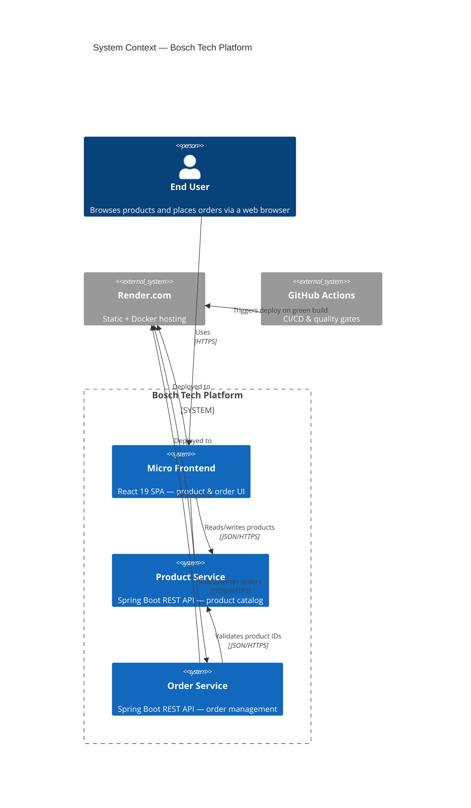
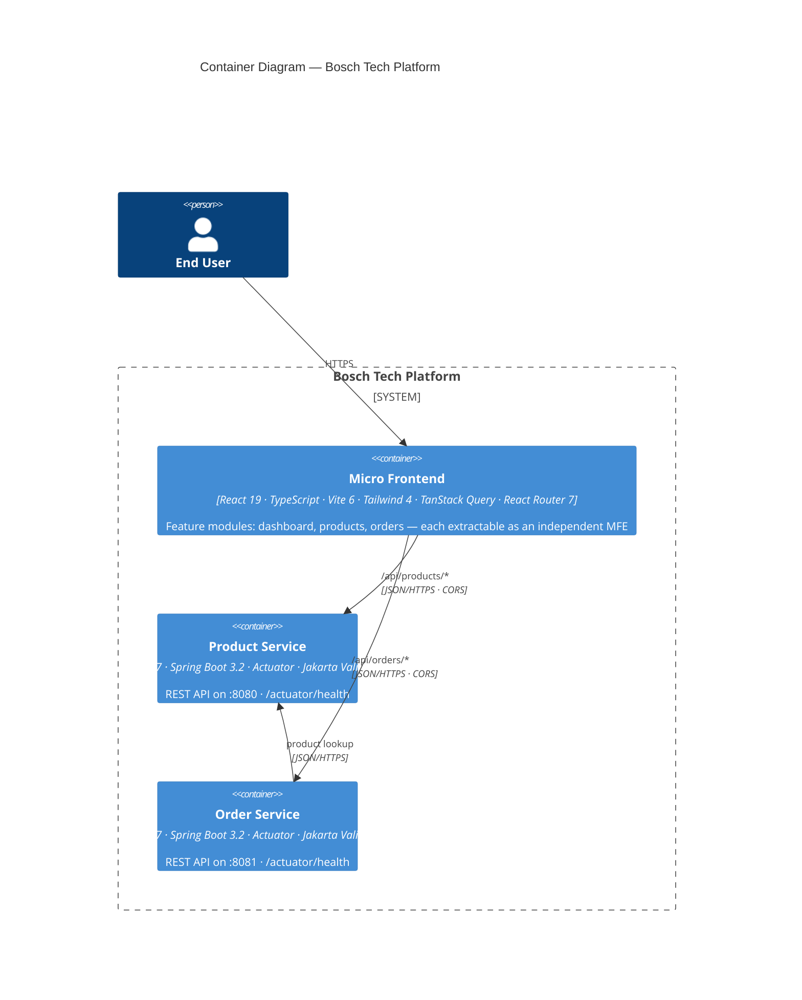
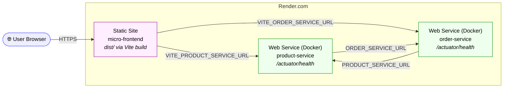
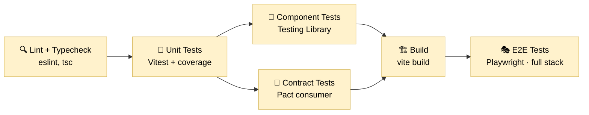
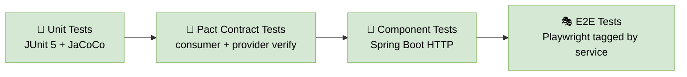
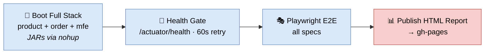
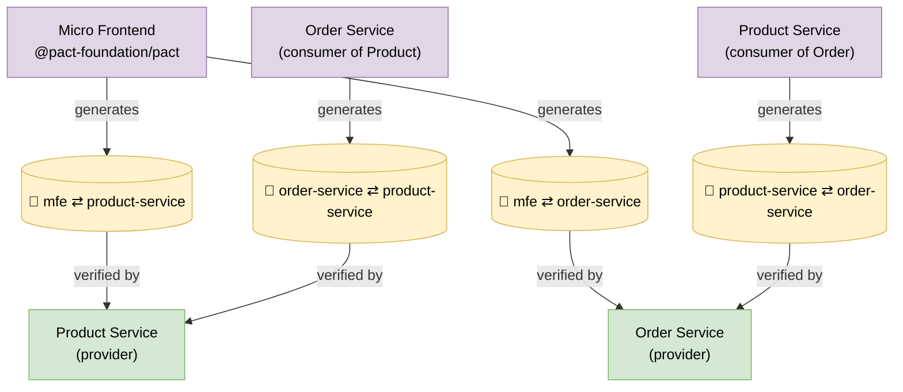
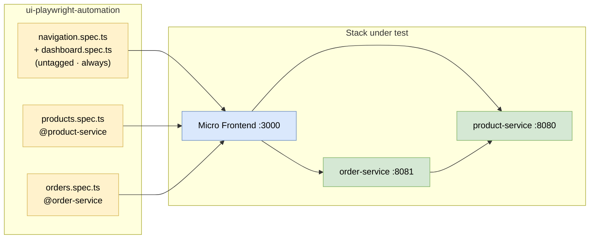
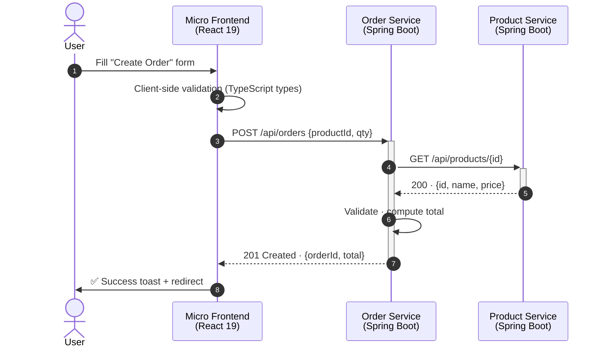
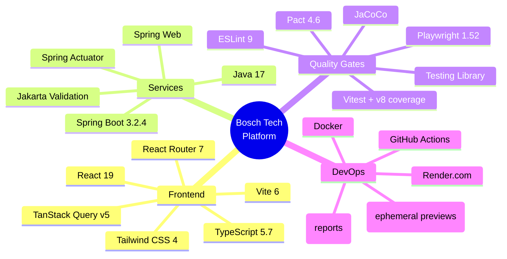

# Bosch Tech Micro Projects — Architecture & Quality Gates

A client-facing overview of the **two microservices**, the **micro‑frontend**, and the **quality gates** that protect every change from commit to production.

All diagrams use [Mermaid](https://mermaid.js.org/) and render directly on GitHub, in VS Code, in Warp, and in most markdown viewers.

---

## 📚 Table of Contents

1. [System Context (C4 Level 1)](#1-system-context-c4-level-1)
2. [Container Diagram (C4 Level 2)](#2-container-diagram-c4-level-2)
3. [Deployment View (Render.com)](#3-deployment-view-rendercom)
4. [CI/CD Quality-Gate Pipelines](#4-cicd-quality-gate-pipelines)
5. [Consumer-Driven Contract Testing (Pact)](#5-consumer-driven-contract-testing-pact)
6. [End-to-End Test Topology (Playwright)](#6-end-to-end-test-topology-playwright)
7. [Quality Gates Matrix](#7-quality-gates-matrix)
8. [Request Flow — Create an Order](#8-request-flow--create-an-order)
9. [Tech Stack at a Glance](#9-tech-stack-at-a-glance)

---

## 1. System Context (C4 Level 1)

Shows the platform in its environment — who uses it and what it talks to.



---

## 2. Container Diagram (C4 Level 2)

Zooms into each deployable unit, ports, and the key libraries inside.



---

## 3. Deployment View (Render.com)

Each repo has its own `render.yaml` — the MFE ships as a static site, services as Docker containers with health-checks wired to Spring Actuator.



---

## 4. CI/CD Quality-Gate Pipelines

Every merge is gated by a multi-stage pipeline. A failure in any stage **blocks the PR**.

### 4.1 Micro-Frontend Pipeline (`micro-frontend/.github/workflows/ci.yml`)



### 4.2 Service Pipeline (both `product-service` & `order-service`)



### 4.3 UI Automation Pipeline — publishes the Playwright report to GitHub Pages



---

## 5. Consumer-Driven Contract Testing (Pact)

Contracts are generated by consumers and verified by providers — catching breaking API changes before they ship.



---

## 6. End-to-End Test Topology (Playwright)

Tests are tagged so each service only runs the E2E slice it owns, while the micro-frontend runs them all.



---

## 7. Quality Gates Matrix

Every colour-coded stage below is enforced by CI and must be **green** to merge.

```mermaid
flowchart TB
    classDef g fill:#d5e8d4,stroke:#82b366,color:#000

    subgraph MF["Micro Frontend"]
      mf1[ESLint 9]:::g --> mf2[TypeScript strict<br/>tsc --noEmit]:::g --> mf3[Vitest unit<br/>+ v8 coverage]:::g --> mf4[Component tests<br/>Testing Library]:::g --> mf5[Pact consumer<br/>contracts]:::g --> mf6[vite build]:::g --> mf7[Playwright E2E]:::g
    end

    subgraph PS["Product Service"]
      ps1[JUnit 5 unit]:::g --> ps2[JaCoCo coverage]:::g --> ps3[Spring validation]:::g --> ps4[Pact consumer<br/>+ provider verify]:::g --> ps5[Spring Boot<br/>component tests]:::g --> ps6[Playwright<br/>@product-service]:::g --> ps7[Actuator<br/>health gate]:::g
    end

    subgraph OS["Order Service"]
      os1[JUnit 5 unit]:::g --> os2[JaCoCo coverage]:::g --> os3[Spring validation]:::g --> os4[Pact consumer<br/>+ provider verify]:::g --> os5[Spring Boot<br/>component tests]:::g --> os6[Playwright<br/>@order-service]:::g --> os7[Actuator<br/>health gate]:::g
    end
```

---

## 8. Request Flow — Create an Order

A happy-path sequence that demonstrates the UI, service-to-service validation, and the contracts in play.



---

## 9. Tech Stack at a Glance



---

## How to Show This to Clients

1. **Open this README on GitHub** — every diagram renders natively, no extra tooling needed.
2. **Live demo** — point them to the Render URLs for the MFE and the two services' `/actuator/health`.
3. **CI evidence** — open a recent PR and walk through the green checks; open the published Playwright report on GitHub Pages.
4. **PDF export** — run `npx @mermaid-js/mermaid-cli -i docs/README.md -o bosch-tech-architecture.pdf` to produce a handout.

> Tip: copy any single diagram into the [Mermaid Live Editor](https://mermaid.live) to tweak colours or export a transparent SVG for slide decks.
